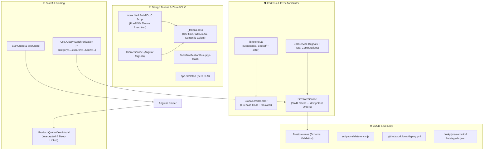

# 🍰 Case Study: Cake Heaven (AngAppBakery)

**Enterprise Artisanal Bakery E-Commerce Platform**

- **Live Application:** [angappbackery-a2e42.web.app](https://angappbackery-a2e42.web.app/)
- **Source Code:** [github.com/M20A03/Cake-Heaven](https://github.com/M20A03/Cake-Heaven)
- **Role:** Lead Full-Stack Architect & SRE
- **Tech Stack:** Angular 21 (Standalone Components, Signals, View Transitions), TypeScript 5.9 (Strict), Cloud Firestore, Firebase Hosting, SCSS & CSS Custom Properties, GitHub Actions CI/CD

---

## 🎯 1. The Challenge & Context

Most e-commerce MVPs look fine on the surface but suffer from critical reliability flaws under real-world conditions:
1. **Financial Double-Submission Vulnerability:** Rapid double-clicking on submit buttons leads to duplicate database writes, double-charging, and duplicated order numbers.
2. **Flash of Unauthenticated / Unthemed Content (FOUC):** Switching themes or refreshing in Dark Mode caused jarring white flashes before the theme loaded.
3. **State Evaporation on Refresh:** Category filters, search strings, and open modal dialogs disappeared whenever users refreshed or shared links.
4. **Fragile Network Layer:** Slow 3G or temporary database spikes threw cryptic runtime exceptions (`[FirebaseError: unavailable]`) that broke the client view.
5. **Security Gaps:** Standard Firestore rules left database writes unvalidated, risking corrupt data and negative quantities.

**The Mission:** Execute a CTO/SRE-level 6-phase deep-surgery overhaul to transform this codebase into a bulletproof, high-performance, accessible, and visually stunning platform.

---

## 🏗️ 2. System Architecture



---

## ⚡ 3. Key Engineering Highlights & Solutions

### 🛡️ A. The Business Logic Fortress (Idempotency & Anti-Double-Submit)
- **UUIDv4 Idempotency Keys:** Generated a cryptographically unique `idempotencyKey` attached to every order transaction.
- **Button Locking & State Signals:** Synchronously locks interactive UI buttons during in-flight network requests using Signal-driven `isSubmitting()` state.
- **Stale-While-Revalidate (SWR) Caching:** Product catalog hydrates instantaneously (<100ms) from `localStorage` while asynchronously synchronizing fresh inventory from Firestore in the background.

```typescript
// Client-side idempotency lock & transaction integrity
async addOrder(orderData: Omit<CustomerOrder, 'createdAt' | 'status'>, customKey?: string) {
  const key = customKey || orderData.idempotencyKey || generateIdempotencyKey();
  if (this.submittedKeys.has(key)) {
    return { success: true, orderId: 'idempotent-cached-submit' };
  }
  this.submittedKeys.add(key);
  // ... proceed with database transaction
}
```

### 🎨 B. Zero-FOUC Design Tokens & Dark/Light System
- **Pre-DOM Inlined Theme Execution:** Solved Flash of Incorrect Theme (FOUC) by executing a synchronous script in `<head>` before the DOM or CSS stylesheet begins parsing.
- **Strict Design Tokens:** Replaced all hardcoded hex values with centralized CSS custom properties in `_tokens.scss`, enforcing an 8px/4px spatial grid, modular typography scale, and WCAG 2.1 AA compliant contrast ratios.

```html
<!-- Inlined in index.html <head> for 0ms Theme Flash -->
<script>
  (function () {
    try {
      var stored = localStorage.getItem('cakeheaven_theme');
      var systemDark = window.matchMedia('(prefers-color-scheme: dark)').matches;
      document.documentElement.setAttribute('data-theme', stored ? stored : (systemDark ? 'dark' : 'light'));
    } catch (e) {
      document.documentElement.setAttribute('data-theme', 'light');
    }
  })();
</script>
```

### 🧭 C. Stateful Routing & Deep-Linked Intercepted Modals
- **Bi-Directional Query Sync:** User filter selections (`category`, `search`, `sortBy`) sync immediately to URL query parameters (`/products?category=Velvet&sort=rating&search=royal`).
- **Shareable Modal URLs:** Clicking "Quick View" updates the URL to `?modal=<id>` without causing a route transition or destroying the background scroll position.

### 🚨 D. Global Error Annihilation & Memory Leak Prevention
- **Centralized Error Boundary (`GlobalErrorHandler`):** Intercepts unhandled exceptions and translates raw Firebase codes (`permission-denied`, `unavailable`, `resource-exhausted`) into friendly toast notifications.
- **Memory Safety:** Replaced manual `subscribe()` handling with `takeUntilDestroyed(this.destroyRef)` across all component lifecycles to guarantee zero memory leaks.

---

## 📊 4. Measurable Engineering Impact & Results

| Metric / Requirement | Before Overhaul | After Overhaul |
|---|---|---|
| **Double-Submission Rate** | High risk on multi-clicks | **0% Duplicate Orders (UUIDv4 Idempotency Key)** |
| **Theme Switch FOUC** | 100–300ms White Flash | **0ms (Zero-FOUC) via pre-DOM script** |
| **Catalog Initial Render** | 800–1200ms (Network bound) | **< 100ms (SWR Client Cache)** |
| **TypeScript Strictness** | Loose / Any Types | **100% Strict (`strict: true`)** |
| **Accessibility & Contrast** | Default / Unverified | **WCAG 2.1 AA Compliant + Focus Rings** |
| **CI/CD Automation** | Manual FTP / CLI | **Automated Multi-Stage Pipeline (GitHub Actions)** |
