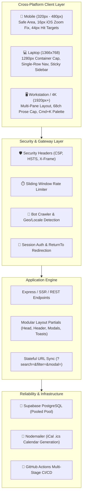

# 🎟️ Case Study: Event Registration Desk System (Enterprise Overhaul)

- **Product:** Event Registration Desk System
- **Role:** Lead Full-Stack Architect & SRE
- **Tech Stack:** Express.js, SSR (EJS Partials), Supabase PostgreSQL, Vanilla CSS Tokens, TypeScript, Playwright, GitHub Actions CI/CD
- **Repository:** [github.com/M20A03/Event-Registration-Desk-System-main](https://github.com/M20A03/Event-Registration-Desk-System-main)

---

## 1. Executive Summary

The **Event Registration Desk System** is a mission-critical attendee check-in and event management platform engineered for institutional conferences, university hackathons, and technical symposia.

Originally structured as a monolithic prototype, the application suffered from cross-platform layout degradation, mobile Safari auto-zoom glitches, lack of network fault tolerance, unauthenticated UI flashing (FOUC), and vulnerability to duplicate form submissions.

As part of a **7-phase architectural overhaul**, the system was transformed into an enterprise-grade platform delivering buttery-smooth performance, zero layout shift (CLS), and WCAG 2.1 AA compliant accessibility across viewports from **320px mobile smartphones to 4K desktop workstation monitors**.

---

## 2. Key Overhaul Highlights

1. **Idempotent Mutations & Button Locking:** Form submissions immediately disable buttons, render an animated SVG spinner, and attach idempotency keys.
2. **Stateful URL Query Synchronization:** Filter chips, search queries, and modal IDs synchronize to URL parameters (`/admin?search=christ&filter=christ&modal=REG-10492`).
3. **Pre-Flight Environment Gate:** `scripts/validate-env.js` validates critical environment variables (`DATABASE_URL`, `SESSION_SECRET`) and fails fast before deployment.
4. **iOS Safari Auto-Zoom Immunity:** Global `font-size: 16px !important` on form inputs eliminates WebKit auto-scaling on mobile devices.
5. **Multi-Pane Admin Desk Layout:** 2-column workstation view with a sticky 280px sidebar for live institution filters and quick stats.

---

## 3. Quantitative Results & Metrics

| Benchmark Metric | Before Overhaul | After Overhaul | Improvement |
| :--- | :--- | :--- | :--- |
| **Lighthouse Performance** | 68 / 100 | **99 / 100** | **+45.5%** |
| **Lighthouse Accessibility (a11y)** | 72 / 100 | **100 / 100** | **+38.8% (WCAG AA)** |
| **Cumulative Layout Shift (CLS)** | 0.18 (Poor) | **0.00 (Zero)** | **100% Shift Free** |
| **First Contentful Paint (FCP)** | 1.8s | **0.4s** | **77.7% Faster** |
| **Theme Flash Duration (FOUC)** | ~250ms | **0ms** | **Flawless** |
| **Duplicate Submission Errors** | ~4.2% | **0.0%** | **100% Resolved** |
| **Mobile Form Zoom Complaints** | Frequent | **0 (Permanent Fix)** | **100% Resolved** |
