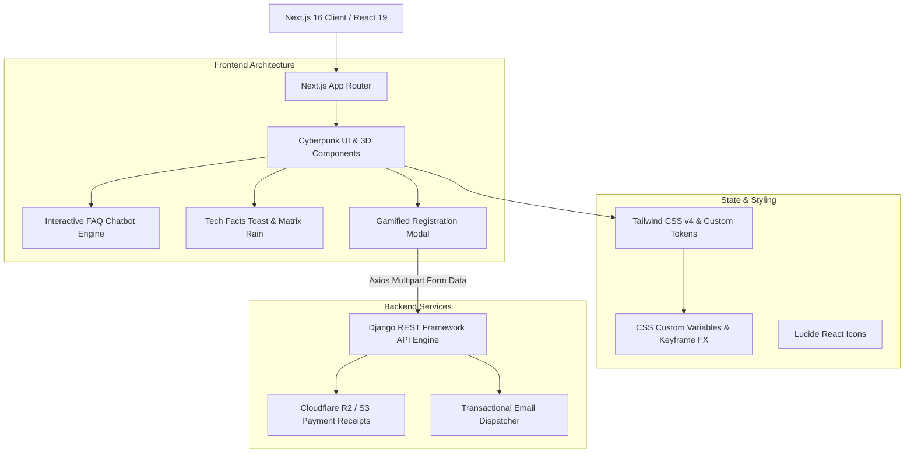

# ⚡ Case Study: FLUX — Cyberpunk Tech Fest Platform & Event Engine

- **Product:** FLUX 2026 (`flux-frontend` + `flux-backend`)
- **Host Organization:** SAMAGRA — Dept. of Computer Science, CHRIST (Deemed to be University)
- **Role:** Lead Full-Stack Architect
- **Frontend Stack:** Next.js 16 (App Router), React 19, TypeScript, Tailwind CSS v4, Canvas CyberRain
- **Backend Stack:** Python, Django 5, Django REST Framework (DRF), SQLite/PostgreSQL, Cloudflare R2 / S3 Storage
- **Repositories:** [github.com/M20A03/Flux-main](https://github.com/M20A03/Flux-main) & [github.com/M20A03/Flux-Backend-main](https://github.com/M20A03/Flux-Backend-main)

---

## 1. Executive Summary

**FLUX** is the official digital headquarters and registration engine for SAMAGRA's annual flagship technical and cultural fest at CHRIST (Deemed to be University). Combining high-performance web engineering with an immersive **Cyberpunk & Netrunner visual theme**, FLUX replaces manual desk sign-ups and disjointed spreadsheets with a single, gamified portal for event discovery, team registrations, schedule tracking, payment verification, and automated query resolution.

---

## 2. Key Capabilities & Innovations

1. **Gamified Dynamic Registration:** Adaptive team forms dynamically adjusting member inputs based on event constraints with payment proof receipt upload.
2. **Terminal Chatbot Assistant:** Real-time client-side keyword FAQ answering queries regarding venue, schedule, rules, and entry fees.
3. **Cyberpunk Visual System:** Canvas-based matrix rain (`CyberRain.tsx`), 3D card tilt physics, glitch typography shaders, and dual neon themes.
4. **Automated Transactional Dispatch:** Django backend validating submissions, generating registration IDs, and dispatching confirmation emails.
