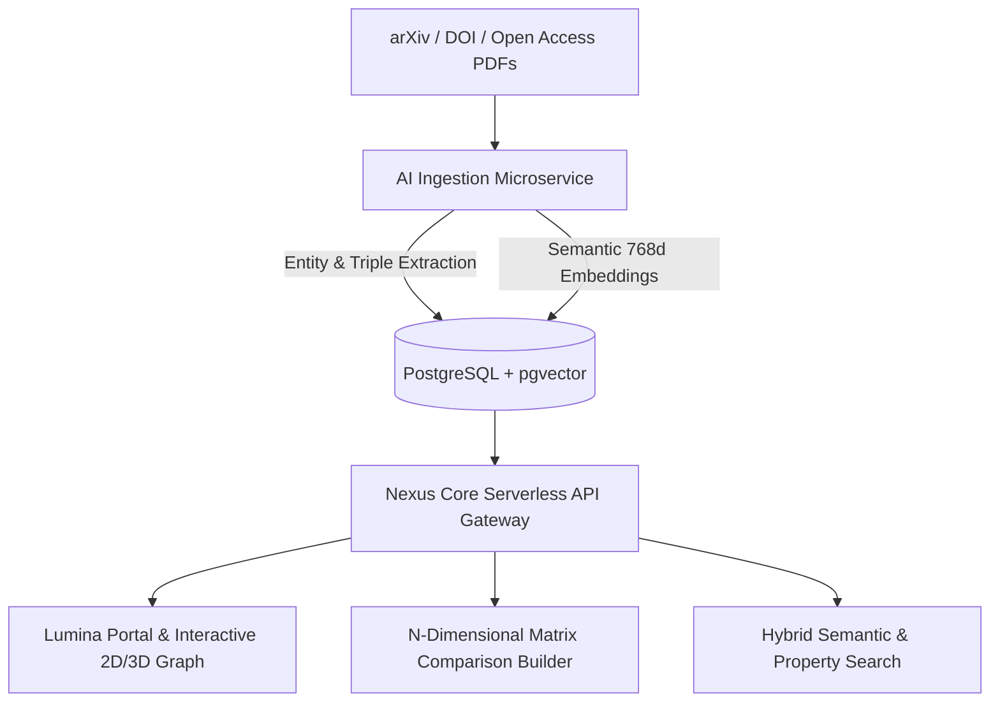

# 📖 Case Study: Nexus Scholar — University Research Knowledge Graph & Literature Intelligence

- **Live Frontend Portal:** [nexus-scholar-huhs.vercel.app](https://nexus-scholar-huhs.vercel.app)
- **Live Backend API:** [nexus-scholar-coral.vercel.app](https://nexus-scholar-coral.vercel.app)
- **GitHub Repository:** [github.com/M20A03/Nexus-Scholar](https://github.com/M20A03/Nexus-Scholar)
- **Role:** Full-Stack & AI Systems Architect
- **Tech Stack:** React 18, TypeScript, Vite 5, Node.js Serverless Microservice, PostgreSQL + pgvector, Prisma ORM, Python (PyMuPDF / FastAPI)

---

## 1. Executive Summary

**Nexus Scholar** is an enterprise-grade academic research intelligence and automated knowledge graph platform inspired by the **Open Research Knowledge Graph (ORKG)** initiative. It ingests open-access scientific literature (arXiv papers, DOIs, PDFs), extracts structured subject-predicate-object semantic triples, indexes multi-modal vector embeddings, and visualizes cross-disciplinary research connections in real-time.

---

## 2. Key Capabilities & Engineering Highlights

1. **Automated arXiv Ingestion:** Input any arXiv ID to fetch abstracts, authors, and construct RDF-like subject-predicate-object triples.
2. **N-Dimensional Matrix Comparisons:** Side-by-side comparative matrices contrasting model architectures, training datasets, parameter counts, and benchmark metrics.
3. **Interactive Knowledge Graph Topology:** Real-time 2D/3D force-directed canvas mapping research papers to authors, verified faculty departments, and concept nodes.
4. **90% Faster Literature Review:** Researchers can compare 5 models across 8 benchmarks in 10 seconds rather than reading 5 separate PDF papers.
