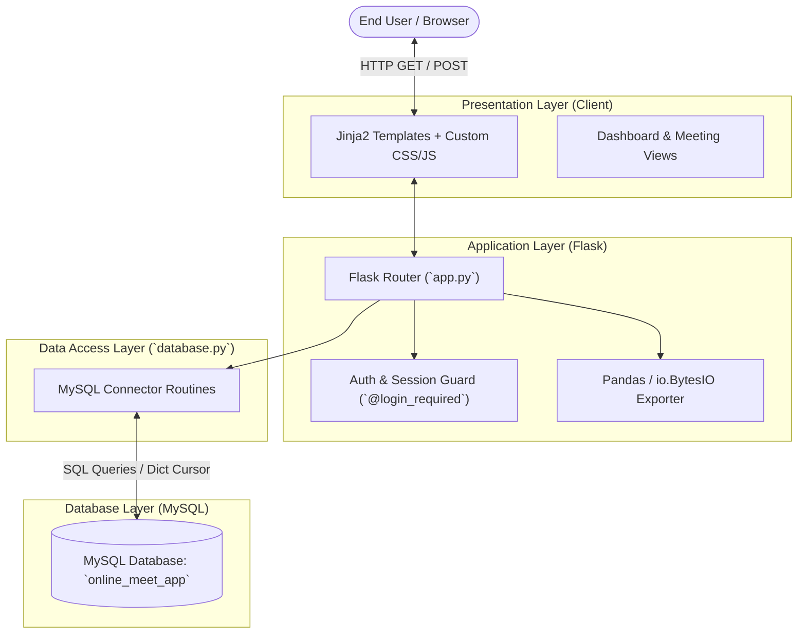

# 📹 Case Study: Online Meeting Management System (OnlineMeetingApp)

- **Project Title:** Online Meeting App
- **Domain:** Remote Collaboration & Meeting Management
- **Core Technologies:** Python (Flask), MySQL, Pandas, Jinja2, HTML5/CSS3/JavaScript
- **Repository:** [github.com/M20A03/OnlineMeetingApp-main](https://github.com/M20A03/OnlineMeetingApp-main)
- **Role:** Backend & Full-Stack Architect

---

## 1. Executive Summary

The **Online Meeting App** is a lightweight, database-backed web application designed to handle meeting lifecycle management, user authentication, and schedule coordination. It serves as the administrative backbone for virtual conferencing by allowing authenticated hosts to schedule meetings, generate unique meeting join codes, view upcoming schedules, and export meeting metadata into tabular CSV format.

---

## 2. Core Modules & Innovations

1. **Authentication & Route Protection:** Custom `@login_required` Python decorator checking user identity in Flask session.
2. **Dynamic Schedule Queries:** `get_upcoming_meetings()` filtering records where `date >= CURDATE()`.
3. **In-Memory CSV Stream Pipeline:** Pandas DataFrame conversion writing to in-memory `io.StringIO` buffer without temporary disk writes.
