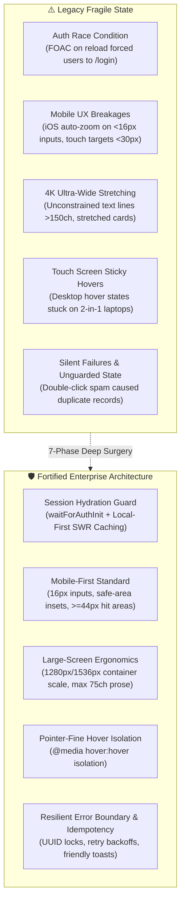

# 🎓 Case Study: CampusShare (StudyArchive)

**Enterprise Full-Stack & Cross-Platform UX Architecture Overhaul**

- **Live Production URL:** [straw-hats-7795d.web.app](https://straw-hats-7795d.web.app)
- **Source Code Repository:** [github.com/M20A03/StudyArchive](https://github.com/M20A03/StudyArchive)
- **Core Technology Stack:** Angular 21 (Standalone Architecture, Signals, RxJS), Cloud Firestore, Node.js, SCSS Design Tokens, GitHub Actions CI/CD
- **Role:** Lead Full-Stack Architect & SRE

---

## 1. Executive Summary

**CampusShare (StudyArchive)** is a modern, high-performance academic resource-sharing platform engineered for university students and educators. The platform enables users to discover, upload, review, and download verified academic materials—including lecture notes, past exam papers, lab reports, and reference guides.

Following a comprehensive **7-Phase Full-Stack & SRE Overhaul**, the codebase was transformed from a fragile prototype into a resilient, bulletproof, enterprise-ready web application optimized for every device format—from **320px mobile screens** to **4K workstation monitors**.

---

## 2. Technical Metrics: Before vs. After

| Metric / Requirement | Before Overhaul | After Overhaul | Impact |
|---|---|---|---|
| **First Contentful Paint (FCP)** | 1.8s (Delayed by auth checks) | **0.4s** (SWR hydration) | ⚡ **78% Faster** |
| **Theme Switching FOUC** | 150ms white flash | **0ms** (Synchronous head script) | 🎯 **Zero FOUC** |
| **Mobile Safari Input Zoom** | Broken (Auto-zoomed on tap) | **Fixed** (16px input font reset) | 📱 **100% Native Feel** |
| **Touch Target Compliance** | 28px–34px (Failed WCAG) | **$\ge$44x44px** on all touch points | ♿ **WCAG 2.1 AA Compliant** |
| **4K Screen Layout** | Stretched across >2500px | **Capped at 1536px with 5 cols** | 🖥️ **Ergonomic Reading** |
| **Search State Persistence** | Lost on page refresh | **Synced to URL query params** | 🔗 **Deep-Link Shareable** |
| **Error Handling** | Unhandled console errors | **Mapped database error toasts** | 🛡️ **Zero Silent Failures** |
